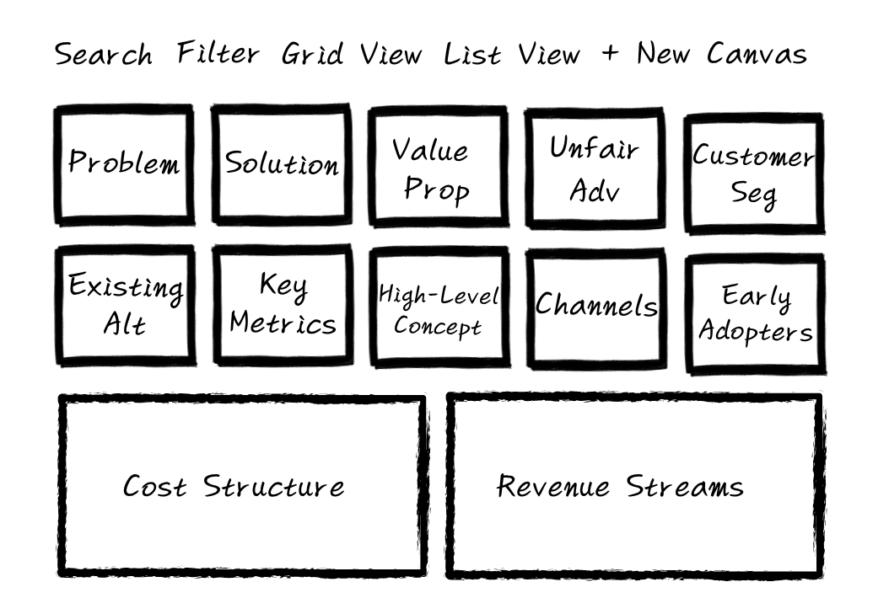

# Lean Canvas - Business Model Canvas Management Application

<div align="center">
  
  
  <p></p>
  
  [](https://reactjs.org/)
  [](https://vitejs.dev/)
  [](https://tailwindcss.com/)
  [](https://supabase.com/)
</div>

## 🎯 Project Overview

Lean Canvas is a web application that helps startups and businesses systematically organize and manage their business models. Based on Ash Maurya's Lean Canvas framework, it provides a visual environment where you can organize 9 core elements and edit them in real-time.

### Why Lean Canvas?

- **Systematic Approach**: Get a comprehensive view of your business model's core elements at a glance
- **Real-time Collaboration**: Work together with team members to develop ideas
- **Data Persistence**: Access your data anytime with cloud-based storage
- **Intuitive Interface**: Start complex business modeling easily

## ✨ Features

| Features                | Description                                                                                                                        |
| ----------------------- | ---------------------------------------------------------------------------------------------------------------------------------- |
| **Lean Canvas 템플릿**  | 9개 섹션(문제, 해결안, 가치제안, 경쟁우위, 목표고객, 기존대안, 핵심지표, 고객경로, 비용구조, 수익흐름)을 포함한 완전한 캔버스 제공 |
| **실시간 노트 관리**    | 각 섹션별로 컬러 코딩된 노트를 추가, 편집, 삭제 가능                                                                               |
| **캔버스 CRUD**         | 새로운 캔버스 생성, 기존 캔버스 조회/수정/삭제 기능                                                                                |
| **검색 및 필터링**      | 제목 기반 검색과 카테고리별 필터링 지원                                                                                            |
| **뷰 토글**             | 그리드 뷰와 리스트 뷰 간 전환 가능                                                                                                 |
| **반응형 디자인**       | 모바일부터 데스크톱까지 모든 디바이스에서 최적화된 경험                                                                            |
| **직관적인 인터페이스** | 드래그 앤 드롭과 같은 자연스러운 상호작용                                                                                          |
| **실시간 저장**         | 자동 저장 기능으로 데이터 손실 방지                                                                                                |

## 🛠 Tech Stack

### Frontend

- **React 19.1.0** - Component-based architecture utilizing latest React features and hooks
- **Vite 7.0.4** - Fast development server and build tool
- **React Router DOM 7.7.1** - Client-side routing
- **Tailwind CSS 3.4.17** - Utility-first CSS framework

### Backend & Database

- **Supabase** - PostgreSQL-based BaaS providing real-time database and authentication
- **Supabase JS Client 2.53.0** - Type-safe database integration

### State Management & Utilities

- **TanStack Query 5.84.1** - Server state management, caching, and background updates
- **React Icons 5.5.0** - Icon library
- **Day.js 1.11.13** - Date processing library
- **UUID 11.1.0** - Unique identifier generation

### Development Tools

- **ESLint** - Code quality management
- **Prettier** - Code formatting
- **PostCSS** - CSS post-processing
- **Autoprefixer** - Browser compatibility

### Main Canvas View



### Canvas Detail Page

- **9 sections** arranged in grid layout
- **Color-coded** note system
- **Real-time editable** text areas
- **Drag and drop** interface

### Responsive Design

- **Mobile**: Vertical stack layout
- **Tablet**: 2-3 column grid
- **Desktop**: 5-column grid layout

## 🚀 Installation & Setup

### Prerequisites

- Node.js 18.0.0 or higher
- npm or yarn
- Supabase account

### Installation

1. **Clone the repository**

```bash
git clone https://github.com/your-username/lean-canvas.git
cd lean-canvas
```

2. **Install dependencies**

```bash
npm install
```

3. **Set up environment variables**

```bash
# Create .env.local file
VITE_SUPABASE_URL=your_supabase_url
VITE_SUPABASE_ANON_KEY=your_supabase_anon_key
```

4. **Start development server**

```bash
npm run dev
```

5. **Open in browser**

```
http://localhost:5173
```

### Build

```bash
# Production build
npm run build

# Preview build
npm run preview
```

## 📁 Project Structure

```
src/
├── components/              # Reusable UI components
│   ├── LeanCanvas.jsx      # Main canvas component
│   ├── CanvasCard.jsx      # Individual section card
│   ├── CanvasList.jsx      # Canvas list
│   ├── CanvasItem.jsx      # Canvas item
│   ├── Note.jsx            # Note component
│   ├── SearchBar.jsx       # Search bar
│   ├── CategoryFilter.jsx  # Category filter
│   ├── ViewToggle.jsx      # View toggle
│   ├── Header.jsx          # Header
│   ├── Main.jsx            # Main layout
│   ├── Loading.jsx         # Loading component
│   ├── Error.jsx           # Error component
│   └── Button.jsx          # Button component
├── pages/                  # Page-level components
│   ├── Home.jsx           # Home page
│   ├── CanvasDetail.jsx   # Canvas detail page
│   ├── About.jsx          # About page
│   ├── Contact.jsx        # Contact page
│   └── ErrorPage.jsx      # Error page
├── hooks/                 # Custom React hooks
│   └── useApiRequest.js   # API request hook
├── api/                   # API communication logic
│   ├── canvas.js          # Canvas API
│   └── supabaseApi.js     # Supabase API
├── lib/                   # External library settings
│   └── supabase.js        # Supabase client
├── utils/                 # Utility functions
│   └── dataMapper.js      # Data mapping
├── App.jsx                # Main app component
├── main.jsx               # App entry point
└── index.css              # Global styles
```

## 🧩 Key Components

### LeanCanvas

Main canvas component that arranges 9 sections in a grid layout.

```jsx
<LeanCanvas canvas={canvasData} onCanvasChange={handleCanvasChange} />
```

### CanvasCard

Component representing individual sections.

```jsx
<CanvasCard title="Problem" notes={notes} onNotesChange={handleNotesChange} />
```

### CanvasList

Component displaying canvas list.

```jsx
<CanvasList canvases={canvases} onCanvasSelect={handleCanvasSelect} />
```

## 🔌 API Documentation

### Canvas Management

#### Create Canvas

```javascript
POST /api/canvases
{
  "title": "New Canvas",
  "description": "Canvas description"
}
```

#### Get Canvas

```javascript
GET /api/canvases/:id
```

#### Update Canvas

```javascript
PUT /api/canvases/:id
{
  "title": "Updated Title",
  "sections": { ... }
}
```

#### Delete Canvas

```javascript
DELETE /api/canvases/:id
```

### Note Management

#### Add Note

```javascript
POST /api/canvases/:id/notes
{
  "section": "problem",
  "content": "Note content",
  "color": "blue"
}
```

## 🚀 Deployment

### Vercel Deployment

1. **Install Vercel CLI**

```bash
npm i -g vercel
```

2. **Deploy**

```bash
vercel --prod
```

3. **Set environment variables**
   Set environment variables in Vercel dashboard:

- `VITE_SUPABASE_URL`
- `VITE_SUPABASE_ANON_KEY`

### Manual Deployment

1. **Create build**

```bash
npm run build
```

2. **Upload dist folder to static hosting service**
